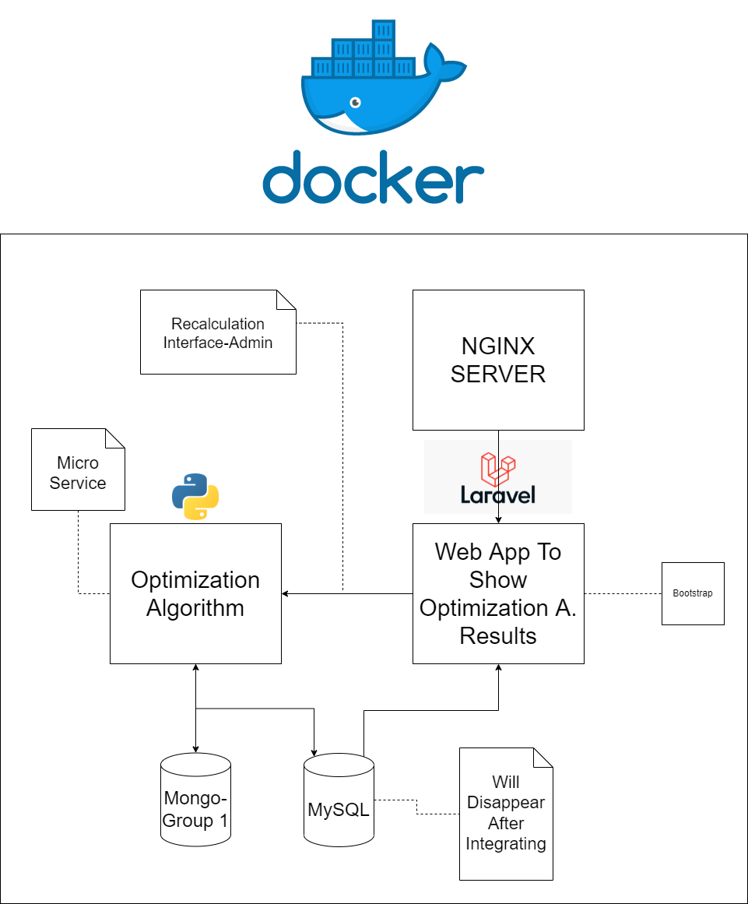

# Architecture

### Guided by our vision and without losing focus on what are the stakeholders' interests involved in this process, we designed the following architecture:

<Row style="display:flex flex-direction: row">
    
</Row>

### Technical Decisions:

Our group shares a mindset for the DS course: We want to present a high-quality level of software. 

Nobody can ensure quality, without practice. That is the main reason for some of the technical choices made. Intentionally select tools and programming languages that all members are used to dealing with. 

Freshmen aren't able to commit themselves to high standards due to their inexperience. We won't take that burden.

Tools:

* Docker: All projects will be sustained by the Docker ecosystem. This is a requirement of the course direction. The reason for this demand is to integrate with Kubernetes to allow easy scalability and compatibility.

* Python: State of the art programming language for M.Learning algorithms. Tools that all members are forced by their academic curriculum use to deal with. No overhead on learning this language and certain of higher standards of quality.

* Laravel: Open source PHP Web Framework that group is used to deal with. Fast development and ships with high levels tools for security and validation.

* Nginx: State of the art web server for PHP based web apps. Fast and easy to configure.

* Bootstrap: Frontend library for rich web layouts. Flexible ensures adaptability to multiple screen sizes out of the box.

* MySQL: Mainstream DB framework. Our main concern is not to deal with data, but to process data, so the decision here was just to configure the simplest element for this task as possible. This will be handled in detail by another group, our task is to ensure easy further integration and MySQL is the right tool for that.