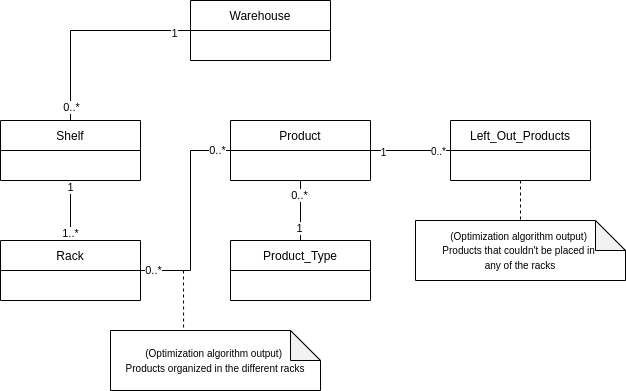

# Genetic Algorithm

## Implemented Optimizations

### Weight Optimization

Heavier products are located closer to the ground, to be more easily picked by
the fork-lift machine.

### Work Optimization

Heavier products should be more easily reachable by the worker.

### Frequency Optimization

Condense the occupied space so that the worker travels the minimum number of
sections, by grouping the most frequent products, minimizing the necessary time
and space.

### Minimize Errors Optimization

Whether on restocking or the collection, by keeping products of the same
category further away from each other, and if that is not possible, avoid
grouping products with similar dimensions (weight, height, width).

### Organization Optimization

Group products of the same category together, so that the warehouse is
organized in a simple and human-friendly way, increasing restocking speed (ex:
painting, screws, chassis products).

## Optimization Algorithm

### Warehouse structure

To simulate the warehouse structure a relational database (in MySQL) was made in parallel with the data_lake team (team 1) to avoid a progression bottleneck that could be caused by different work flows between the teams and to be able to test the algorithms with a sort of placeholder database. For this testing to be possible, different mocks, specialized for the evaluation of the different metrics, were created.

#### Schema

The database follows the following schema:

<Row style="display:flex flex-direction: row">
    
</Row>

### Communication with webapp
<!-- falar com frontend-->

### Algorithm Behaviour

The algorithm starts by generating an initial population, each individual being a warehouse layout. After that preliminary setup is done, the genetic algorithm itself begins. The following procedure will be run the corresponding amount of times, depending on the number of iterations given.

The layout that has the highest score and another random layout reproduce, creating a child layout. There is also a mutation chance involved, which means that, with a given probability, the child will receive even further modifications. The least fit individual is then removed from the population, giving its place to the newly generated layout.

Throughout the repetition of this, we will end up with better layouts, those being the most suitable to meet the solicited requirements. After the execution ends, the best layout is chosen.

### Crossover

In genetic algorithms, crossover, also called recombination, is a genetic operator used to combine the genetic information of two parents to generate new offspring.
In this problem, each individual is a layout of the warehouse. Therefore, the crossover must generate a new layout based on the characteristic of the two parent layouts.
The crossover function, which we called reproduce(), is implemented in the file `logic.py`.
It starts by sorting the storage products in descending order by weight and width as this reduces the chances of a product not fitting into the child layout as they are being placed.
After creating the child object, with the same structure as the warehouse of the factory, we loop through these products and, for each of them, we randomly choose one of the parents, and we collect the id of the rack of that parent where the product in question was placed. If this product can be successfully placed in the same rack in the child layout, we skip to the next product. In case the parent does not contain this product, or it can't be placed in this rack in the child layout, we try to apply the same process to the other parent, trying to place the product in the same rack where it is placed in this parent. There is also a chance that this second parent does not contain the product either, or that it cannot be placed in the rack where it was placed on this parent. In this case, we try to simply place the product in a random place in the child layout. Finally, after trying to place all products in the child layout, we update the products out, that is, the list of products that failed to be placed in the new generated layout.

### Mutation

In genetic algorithms, there is another genetic operator called mutation which is used to maintain genetic diversity from one generation of a population of individuals to the next. It consists of altering a characteristic of a newly generated individual, and it must occur with a small probability. In this problem, at each iteration of the algorithm, there is a 20% probability that the generated child will mutate. The mutation function is also implemented in the file `logic.py`. In this context, a mutation consists of choosing a random product from the child layout and changing its location, by removing it and then replacing it in a random place in the warehouse. Additionally, in each mutation, there is also an attempt to introduce a product that was out of the warehouse (from the list of products out) in the new layout.

## Implemented Metrics

### Weight Metric

The weight metric will prioritize layouts, whose heaviest products are situated closest to the ground level. To achieve this, the racks with the lowest height, from each shelf are considered the ideal racks to place the products on. A flawless layout, by this metric's perspective, will have all of the products stored on those lower racks.

### Work Metric

The work metric will prioritize layouts, whose products are stored closest to the chest level of the workers who will pick them up. The point is that the worker won't have to do any additional movements (crouch or climb a ladder), to get the product. This reduces the amount of effort necessary to get a product into the cart. The aforementioned effort is calculated using the work formula from physics: `W = fd cos θ`

### Frequency Metric

This metric consisted of condensing the most frequent products into the minimum number of shelves. The solution we found for this is to maximize the sum of the differences in the frequencies of the various shelves. First, we loop through the shelves and their products and sum their frequencies so that we end up with a list where each value corresponds to the sum of the products frequencies of a given shelf, sorted in descending order. For example, if there were three shelves, whose sum of frequencies would result in the list [14, 5, 2], the score of that layout would be the sum of the frequencies differences, which in this case is (14-5) + (5-2) = 12.

To ensure the normalization of the score, we must divide it by the score of the best hypothetical case, which is the one where all the products fit on one shelf. In this context, this best score is calculated by summing the frequencies of all products. For the previous example, the best scenario would result in the list [21, 0, 0], whose score would be 21. Finally, the normalized score must be multiplied by the factor received from the web app, which indicates the importance to be given to this metric.

### Organization Metric

To improve warehouse organization, products of the same type must be placed on the same shelves. The calculation of the score of a layout according to this metric starts by filling a list (variable `shelves_count_types`) with a dictionary for each shelf in the warehouse that contains a key for each product type found in that shelf and whose value is the number of products of that type placed on that shelf. Then, we loop through these dictionaries and for each of them, we get the highest value (variable `max_val` - biggest number of products of the same type) and the score is improved by 2max_val. For the other types on the shelf, we start decreasing the score by 2val2. This way, we favour the prevalence of one type on each shelf.

To achieve the normalization of the score, we must also divide it by the score of the best hypothetical case, which in this case is the one where there is only one product type per shelf (complete separation of types).
For this, we fill a dictionary whose keys are the existing product types in the warehouse and the corresponding values are the total number of products of that type in storage (variable `total_types`). Then, after sorting it in descending order by the values, we loop through it, increasing the score by 2elem, where `elem` is the number of products of the type in question. If the number of shelves is insufficient to fill the warehouse in a way that there is only one product type per shelf, we decrease the score by 2missing_elem2, where `missing_elem` is the number of products of a given type that have not yet been counted towards the score.
Finally, the normalized score must also be multiplied by the factor received from the web app, which indicates the importance to be given to this metric.

### Minimize Errors Metric

This metric's goal is to minimize the errors/mistakes when picking up the products, for example, a worker picking the wrong set of nails. With this purpose in mind, we have to define what increases the possibility of these mistakes. The rationale applied was, that if similar products are placed together, the error rate increases. Similar products are products that have the same type/category. A perfect layout would be one in which shelves only have a product of each type, however, when this is not possible, a second set of rules were applied. Even if two products are in the same category their dimensions may vary widely, when a perfect layout isn't attainable, the distance between those products' dimensions are taken into account, favouring the separation of similarly sized products. These distances are calculated by the euclidian distance between vectors with the following format: `Vx = (height_x, width_x, weight_x)`
