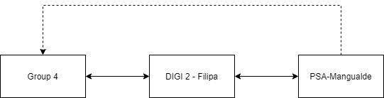
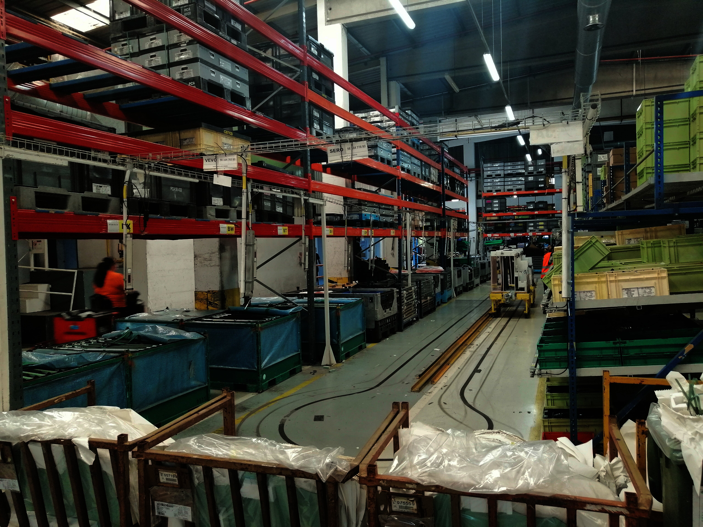
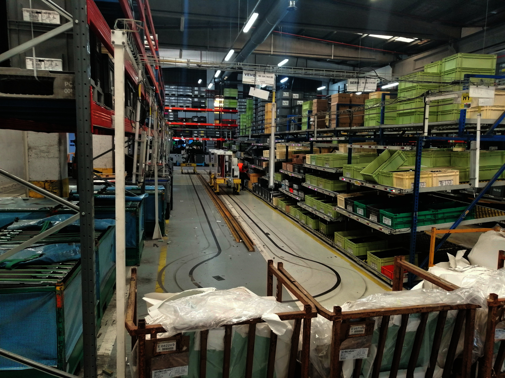
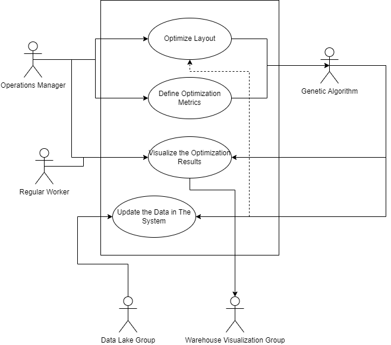

# Domain Analysis

### Client Analysis and Information Flow Schema

Our final client is the factory of the French automaker Peugeot in Viseu, Portugal, PSA. However, our direct call is to the FEUP Research Lab, DIGI 2. It is that as middleman and consultant in the process to promote faster and more efficient communication.

PSA Peugeot-Citroen: Located in Mangualde, Viseu, is one of two factories that produce cars in Portugal. Founded in 1962, it employes 700 workers and has a production line of light cargo vehicles for Citroen Peugeot and Opel.

DIGI 2: Lab funded at FEUP that presents itself on the website as follows:
* The Digital and Intelligent Industry Lab is part of the Research Center for Systems and Technologies (SYSTEC), Faculty of Engineering of the University of Porto (FEUP).

Our contact at DIGI 2 is Filipa Barros, researcher of this lab.

The following diagram specifies the flow information will flow in this process:

<Row style="display:flex flex-direction: row">
    
</Row>

### Warehouse Photos and Analysis

Our project targets items organization on the shelves.

These industrial shelves are called **Racks** they are famous in the sector because of their mobility and adaptability, without compromising weight capabilities, they supply to their owners. Racks are easily configured to adjust the warehouse to dynamic necessities.

Racks can be abstracted in a more suggestive word to IT Engineers as a matrix whose content is easily configurated and whose cell can mutate their location without much overhead. 

Some photos of the interior of this PSA warehouse, kindly supplied to us by Filipa Barros, are the following:

<Row style="display:flex flex-direction: row">
    
    
</Row>

### Group Organization and Dynamics

Our group will follow a Scrum methodology to execute the goal we proposed ourselves. To achieve this Scrum approach several minor techniques will be adopted, one major one will be a Github Flow organization of our repository.

In the DS course, the first sprints will be executed by four different groups. All groups share the same vision, we need to update the efficiency of this warehouse to be smarter and more resilient to human errors that cost a price higher than the one wished by the company headers, but working in four different, well-defined verticals:

1. Optimization,
2. Warehouse Digital Tween,
3. IoT Mess Communication,
4. Sensors Data Collection and Processing.

The last Scrum sprints will target the integration in a unique tool that united will make this warehouse more efficient and well organized.

## Stakeholders. Actors Diagram

#### Current Tasks of Stakeholder:

Ours analyse identified using information gathered from the client that there are mainly two stakeholders identified for this optimization project:

* The Operation Manager - This warehouse has a chief of operations whose task is to organize items in it as well as stocks. Coordinate the operation of parts refill, the introduction of new parts as well as the removal of deprecated ones. 

* Regular Factory Workers - This group of people are the everyday engine of the entire factory. They share the responsibility of manufacturing cars and collecting the parts they need from the warehouse. 

#### How Stakeholders Contact With Our Tool:

* The Operation Manager - An authenticated operation manager will be responsible for issuing optimization commands and selecting the metrics that should count for optimization. Another element they will handle is the capability to visualize the output of the algorithms so they can proceed with the effective layout reconfiguration.

* Regular Factory Workers - They are truly impacted by any effects that algorithm output, either produce positively or negatively. They can access the layout reconfiguration.

#### UML Actors Diagram

From the stakeholder analysis, we produced the UML actor diagram below presented. This kind of graphical approach synthesizes the information described in the previous section of this document.

<Row style="display:flex flex-direction: row">
    
</Row>

* Note: There is a reference to the work of two different groups. In the final stage, the data lake group will feed our project in real-time, and our output result will feed the tool for warehouse visualization that will be designed by another group.

## UML Class Diagram