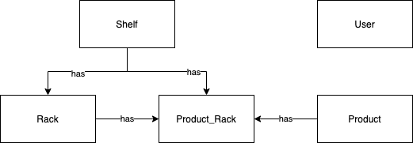
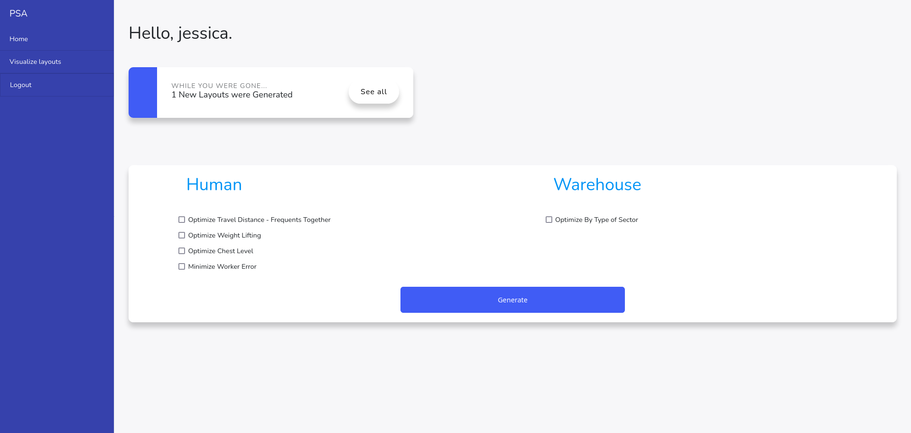

# Code Reference 

## Table of Contents
1. [Views](##views)
    1. [Inherit common UI elements](##inheritance)
2. [Models](##models)
3. [Authentication & Authorization](##auth)
4. [Communication with Optimization Algorithm](##communicationAlgorithm)
5. [Execution of Optimization Algorithm via web app](##webAlgorithm)
6. [Visualize Layout](##visualizeLayout)
_________________

## Views <a name="views"></a>

View files are located in *resources/views*. 

### Inherit common UI elements <a name="inheritance"></a>
Common components across most of the applications' views are defined in *app.blade.php*. For example, the side navigation menu is defined there. 

In order for another view to inherit the elements defined in *app.blade.php*, it needs to wrap it's content with 

````php
    @extends('app')
    @section('content')
    ...
    @endsection
````

For example,

````php
<!DOCTYPE html>
    <html lang="{{ str_replace('_', '-', app()->getLocale()) }}">
    <head>
        ...
    </head>
        @extends('app')
        @section('content')
        ...
        <div class="child-element">
            <h1>I am being wrapped...</h1>
        </div>
        ...
        @endsection
    </body>
</html>
````

_________________

## Models <a name="models"></a>

Model files are located in *app/models*.  



_________________

## Authentication & Authorization <a name="auth"></a>

For a user to be able to use the web app, it needs to have an account and be logged in. 

The Authentication and Authorization were built using Laravel's default packages, by running the command

````
php artisan make:auth
````

The autentication configuration file is located at *config/auth.php*.


_________________

## Communication with Optimization Algorithm <a name="communicationAlgorithm"></a>

This web application acts as a frontend that interacts with the optimization algorithm for requesting suggested layouts for the warehouse.

The communication between the web application and the algorithm is handled in *app/Http/Controllers/CommunicationController.php*.

It uses sockets to establish communication and sending the desired optimization metrics.

_________________

## Execution of Optimization Algorithm via web app <a name="webAlgorithm"></a>

To generate an optimized layout by the web app, we can click on the generate button after chosing the metrics we want to use and the number factor to be applied. 


After the optimization algorithm finishes, it will show a notification to alert that it wasn't seen yet. This was done by keeping track of the `is_read` attribute.



_________________

## Visualize Layout <a name="visualizeLayout"></a>
A layout page was created in case the integration with the other groups could not be completed. This page shows one or more layouts. We can choose the layout we want to see by choosing it from the dropdown table.


